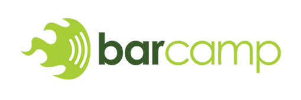

# YYCjs Camp

---

## Brought to you by

## David Luecke

* GitHub: [daffl.github.com](http://daffl.github.com), Twitter: [@daffl](http://twitter.com/daffl)

## Eric Kryski

* GitHub: [ekryski.github.com](http://ekryski.github.com), Twitter: [@ekryski](http://twitter.com/ekryski)

## Tony Grimes

* Twitter: [@tonygrimes](http://twitter.com/tonygrimes)

---

## Our Sponsors

## Assembly Co-working Space

## PetroFeed

---

## Our Sponsors

## Village Brewery

---

## The [YYCJS](https://github.com/yycjs) year

* [Becoming an Open Source, JavaScript, Hipster 101](https://github.com/yycjs/open-source-intro)
* [jQuery, Templating, and Build Tools. Oh My!](https://github.com/yycjs/jquery-templates-builds)
* [Node Up! Server side JavaScript FTW!]()
* [NodeJS Auth & Structure](https://github.com/yycjs/node-auth-structure)
* [Client Side MVWTF](https://github.com/yycjs/mvwtf)
* [It's all about the tests, Yo!](https://github.com/yycjs/javascript-testing)
* [Module Loading & Generators](https://github.com/yycjs/module-loading-generators)
* [SEO & i18n](https://github.com/yycjs/seo-i18n)
* [Mobile madness](https://github.com/yycjs/mobile-madness)

---

## Next Year

* What's new and exciting
* Back to the basics
    * JavaScript, the programming language
    * Introduction to jQuery
* Hardware JS
* More NodeJS

---

## What's a barcamp?

[Barcamp](http://en.wikipedia.org/wiki/BarCamp) is an _Un-conference_

* Free to join
* Free to add topic
* Free to move around
* Free stage interaction
* Free discussion scope
